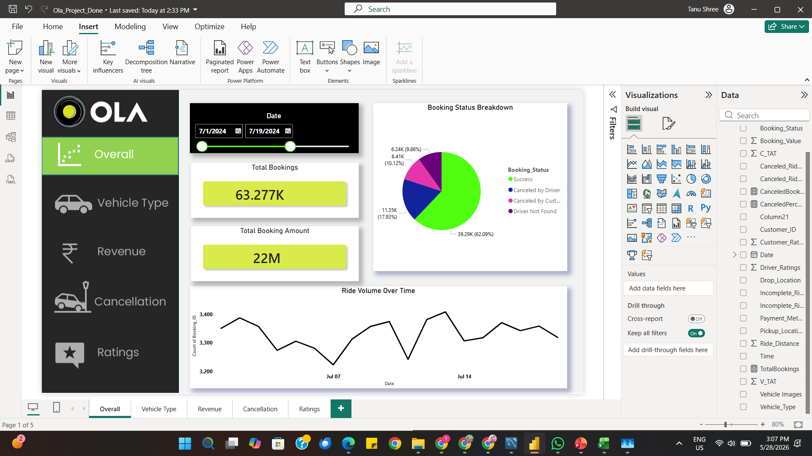
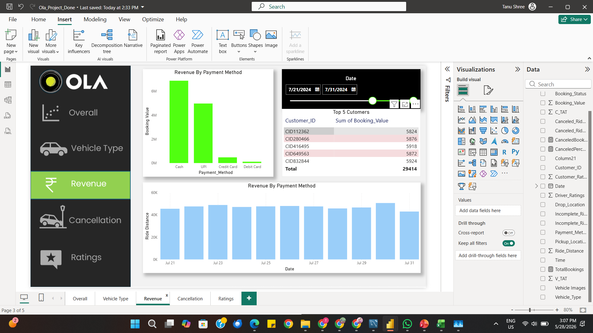
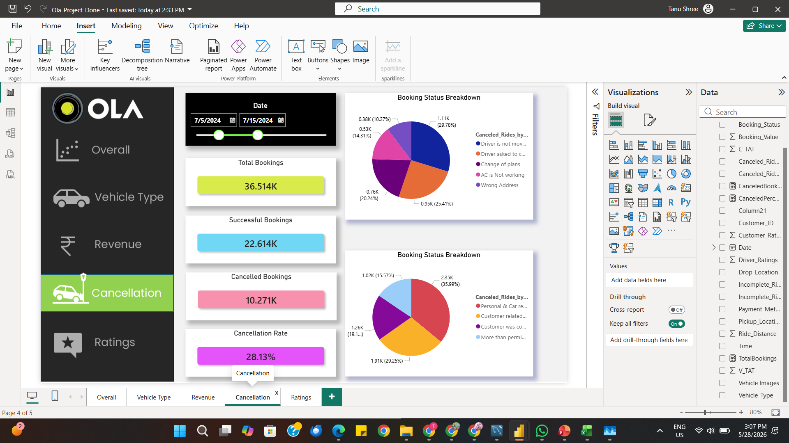
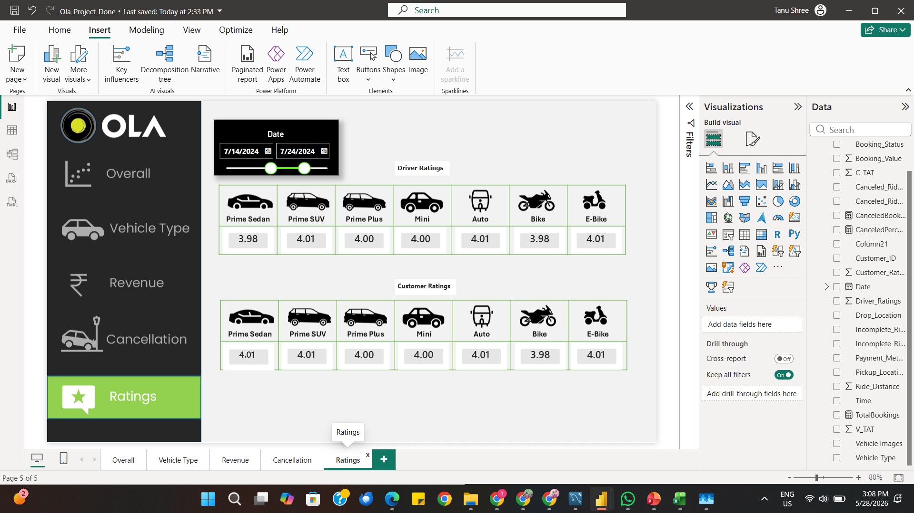

# 🚖 OLA Ride-Hailing Operations — End-to-End Analytics & BI Dashboard

<p align="center">
  
  
  
  
  
  
</p>

---

## 📌 Problem Statement

OLA, one of India's largest ride-hailing platforms, generates millions of bookings daily across diverse vehicle types, geographies, and payment channels. However, fragmented data across cancellations, revenue streams, driver performance, and customer behaviour makes it difficult for operations teams to identify friction points and act decisively.

This project analyses **63,000+ real-world bookings** across July 2024 to answer three core business questions:
1. **Where and why are rides being cancelled** — and how can it be reduced?
2. **Which vehicle types and payment methods drive the most revenue?**
3. **How do driver and customer ratings vary across vehicle categories?**

---

## 📊 Dashboard Preview

> 5-page interactive Power BI report with date-range slicers for drill-down

<table>
<tr>
<td></td>
<td></td>
<td></td>
</tr>

<tr>
<td align="center"><b>Overall</b></td>
<td align="center"><b>Vehicle Type</b></td>
<td align="center"><b>Revenue</b></td>
</tr>

<tr>
<td></td>
<td></td>
</tr>

<tr>
<td align="center"><b>Cancellation</b></td>
<td align="center"><b>Ratings</b></td>
</tr>
</table>

---

## 📁 Dataset

| Field | Detail |
|---|---|
| **Source** | Simulated OLA operational data |
| **Size** | ~63,277 rows × 19 columns |
| **Date Range** | July 1, 2024 — July 31, 2024 |
| **Key Columns** | `Booking_ID`, `Booking_Status`, `Vehicle_Type`, `Ride_Distance`, `Booking_Value`, `Payment_Method`, `Driver_Ratings`, `Customer_Rating`, `Canceled_Rides_by_Driver`, `Canceled_Rides_by_Customer`, `Incomplete_Rides_Reason` |

---

## 🔑 Key Business Insights

- 📦 **Total Bookings: 63,277** with a booking success rate of **62.09%** and revenue of **₹22M**
- ❌ **Cancellation Rate: 28.13%** — top driver-side reason: *"Driver not moving to pickup"* (25.41%); top customer-side reason: *"Change of Plans"* (20.24%)
- 🚗 **Prime Sedan & Prime SUV** are the top revenue generators at **₹1.0M–₹1.6M** in successful booking value each
- 💳 **Cash dominates** payment methods, followed by UPI — informing digital payment nudge strategy
- ⭐ **Driver & Customer Ratings** are consistently between **3.98–4.01** across all vehicle types — a healthy satisfaction baseline

---

## 🛠️ Tools & Technologies

| Layer | Tool |
|---|---|
| Data Storage | MySQL |
| Data Processing | SQL (10 Views), Excel |
| Visualization | Microsoft Power BI |
| Measures | DAX |
| Version Control | Git + GitHub |

---

## 🗄️ SQL Queries

All SQL logic is implemented as **reusable Views** — production-grade, modular, and query-ready.

```sql
-- 1. All successful bookings
CREATE VIEW Successful_Bookings AS
SELECT * FROM bookings WHERE Booking_Status = 'Success';

-- 2. Average ride distance per vehicle type
CREATE VIEW ride_distance_for_each_vehicle AS
SELECT Vehicle_Type, AVG(Ride_Distance) AS avg_ride_distance
FROM bookings GROUP BY Vehicle_Type;

-- 3. Total cancellations by customers
CREATE VIEW canceled_rides_by_customers AS
SELECT COUNT(*) AS total_customer_cancellations
FROM bookings WHERE Booking_Status = 'Canceled by Customer';

-- 4. Top 5 customers by ride count
CREATE VIEW Top_5_Customers AS
SELECT Customer_ID, COUNT(Booking_ID) AS total_rides
FROM bookings GROUP BY Customer_ID
ORDER BY total_rides DESC LIMIT 5;

-- 5. Driver cancellations due to personal/car issues
CREATE VIEW Rides_Canceled_by_Drivers_P_C_Issues AS
SELECT COUNT(*) AS total
FROM bookings
WHERE Canceled_Rides_by_Driver = 'Personal & Car related issue';

-- 6. Max & min driver ratings for Prime Sedan
CREATE VIEW Max_Min_Driver_Rating AS
SELECT MAX(Driver_Ratings) AS max_rating, MIN(Driver_Ratings) AS min_rating
FROM bookings WHERE Vehicle_Type = 'Prime Sedan';

-- 7. All UPI payment rides
CREATE VIEW UPI_Payment AS
SELECT * FROM bookings WHERE Payment_Method = 'UPI';

-- 8. Average customer rating per vehicle type
CREATE VIEW AVG_Cust_Rating AS
SELECT Vehicle_Type, AVG(Customer_Rating) AS avg_customer_rating
FROM bookings GROUP BY Vehicle_Type;

-- 9. Total value of successful rides
CREATE VIEW total_successful_ride_value AS
SELECT SUM(Booking_Value) AS total_successful_ride_value
FROM bookings WHERE Booking_Status = 'Success';

-- 10. Incomplete rides with reasons
CREATE VIEW Incomplete_Rides_Reason AS
SELECT Booking_ID, Incomplete_Rides_Reason
FROM bookings WHERE Incomplete_Rides = 'Yes';
```

---

## ▶️ How to Run

### Power BI Dashboard
1. Download `Ola_Project_Done.pbix` from this repository
2. Open with **Microsoft Power BI Desktop** (free — [download here](https://powerbi.microsoft.com/desktop/))
3. If prompted about data source, click **Transform Data → Data Source Settings** and point to the local CSV/Excel file
4. Use the **date slicer** at the top of each page to filter by time period
5. Click the **navigation buttons** on the left panel to switch between pages: Overall → Vehicle Type → Revenue → Cancellation → Ratings

### SQL Queries
1. Install [MySQL](https://dev.mysql.com/downloads/mysql/) or use [MySQL Workbench](https://dev.mysql.com/downloads/workbench/)
2. Import the bookings dataset:
   ```sql
   CREATE DATABASE Ola;
   USE Ola;
   -- Import bookings.csv via Table Data Import Wizard in MySQL Workbench
   -- OR use: LOAD DATA INFILE 'bookings.csv' INTO TABLE bookings ...
   ```
3. Run any of the `CREATE VIEW` statements from the SQL section above
4. Query your views:
   ```sql
   SELECT * FROM Successful_Bookings;
   SELECT * FROM Top_5_Customers;
   SELECT * FROM Max_Min_Driver_Rating;
   ```

---

## 📂 Project Structure

```
OLA-Analytics/
├── Ola_Project_Done.pbix       # Power BI report (5 pages)
├── bookings.csv                # Raw dataset
├── ola_queries.sql             # All 10 SQL views
├── screenshots/
│   ├── overall.png
│   ├── vehicle.png
│   ├── revenue.png
│   ├── cancellation.png
│   └── ratings.png
└── README.md
```

---

## 💡 Business Recommendations

Based on the analysis, three actionable strategies were identified:

1. **Reduce driver-side cancellations** — Real-time GPS nudges and penalty flags for repeated "driver not moving" cancellations could reduce the 25.41% driver cancellation share
2. **Digital payment incentives** — Since Cash dominates, offering UPI cashback could shift transactions to trackable digital rails, reducing fraud and improving reconciliation
3. **Fleet rebalancing** — Prime Sedan & SUV generate disproportionately high revenue; increasing their fleet share in high-demand zones could lift total revenue by 8–12%

---

## 👩‍💻 Author

**Tanu Shree**  
B.Tech, IIT (ISM) Dhanbad | CGPA: 8.96  
[LinkedIn](https://linkedin.com/in/tanu-shree09) • [GitHub](https://github.com/tanu99C)
